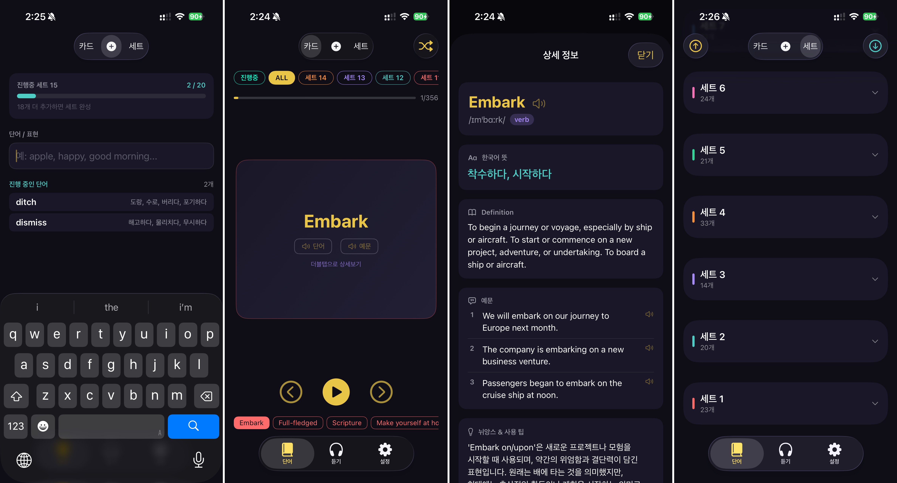
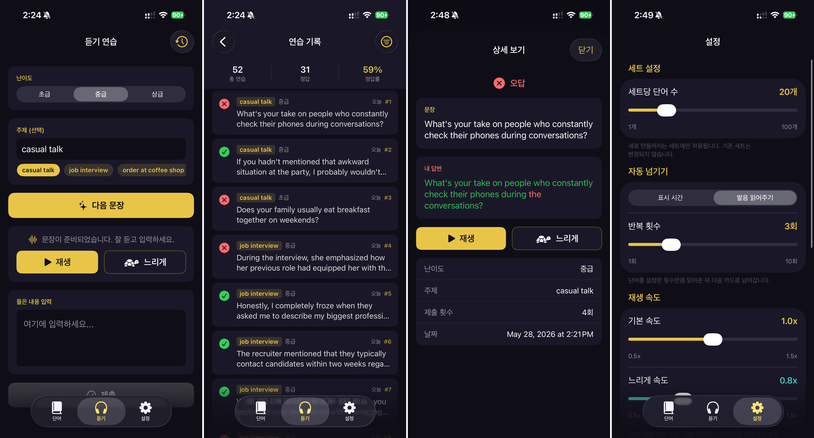

# VocabApp

영어 단어 학습과 듣기 연습을 위한 개인용 iOS 앱입니다. 단어를 직접 입력하거나 이름으로 검색해 자동 완성하고, 플래시 카드로 복습하며, 듣기 연습 모드로 청취력을 훈련할 수 있습니다. Google WaveNet TTS(미설정 시 AVSpeechSynthesizer 폴백)를 사용합니다.

## 주요 기능

### 단어 관리
- 단어, 한국어 뜻, 예문을 직접 입력해 추가
- 단어명으로 검색 시 **Anthropic Claude API**를 통해 발음 기호, 품사, 영어 상세 정의, 예문, 뉘앙스 팁, 관련 단어를 자동으로 불러옴
- 단어 목록 탐색 및 필터링, 항목을 탭하면 상세 카드 확인 가능

### 세트 관리
- 단어는 **20 (조절가능) 개 단위 세트**로 자동 구성
- 전체 세트 목록과 각 세트의 단어 수 확인
- 20개가 채워지지 않은 세트는 "진행 중" 상태로 표시

### 플래시 카드
- 카드를 뒤집어 한국어 뜻과 예문 확인
- 세트 내 순서대로 넘기거나 셔플로 무작위 복습

### 듣기 연습
- 단어를 듣고 받아 적는 연습
- 재생 속도 조절 가능 (보통 / 느리게)
- 세션 기록에 답변과 점수 저장

### TTS (음성 합성)
- **기본**: Google Cloud WaveNet TTS (`en-US-Wavenet-D`), 자연스러운 속도로 재생
- **폴백**: Google TTS 키 미설정 시 `AVSpeechSynthesizer` 사용
- 보통 속도와 느린 속도 모두 지원

### 설정
- **Anthropic API 키**와 **Google Cloud TTS API 키**를 iOS Keychain에 안전하게 저장
- 키는 평문으로 디스크에 기록되지 않음

## 요구 사항

| 항목 | 버전 |
|---|---|
| iOS | 17.0 이상 |
| Xcode | 15.0 이상 |
| Swift | 5.9 이상 |

**API 키 (앱 설정에서 입력):**

- **Anthropic API 키** — 단어 검색 및 자동 완성에 필요
- **Google Cloud TTS API 키** — 선택 사항, WaveNet 음성 활성화 (미설정 시 AVSpeech 사용)

## 시작하기

1. 레포지토리를 클론하고 Xcode에서 `VocabApp.xcodeproj`를 엽니다.
2. 대상 기기 또는 시뮬레이터(iOS 17+)를 선택합니다.
3. `⌘R`로 빌드 및 실행합니다.
4. 앱 내 **설정** 탭에서 API 키를 붙여 넣습니다.

## 스크린샷

<!-- 스크린샷을 여기에 추가하세요 -->
